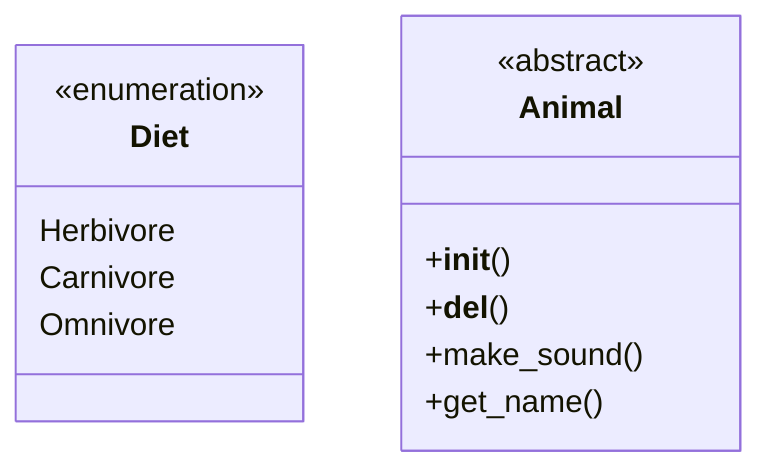
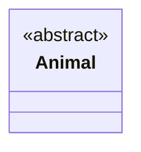
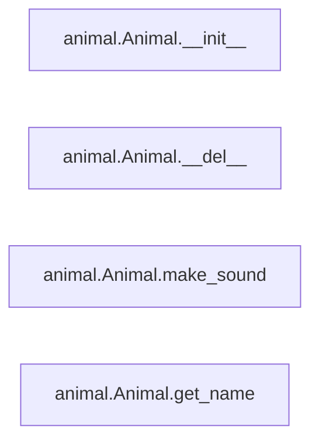
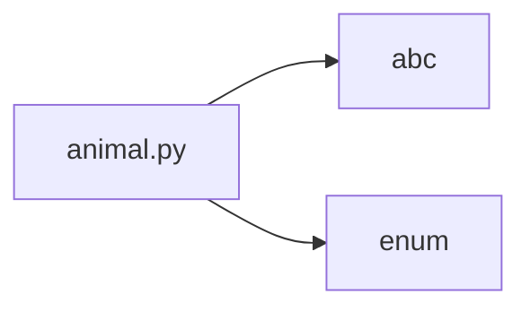
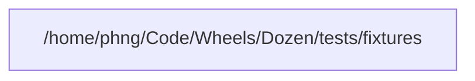

# Contract Graph

## Class Diagram

```mermaid
classDiagram
  class Diet {
    <<enumeration>>
    Herbivore
    Carnivore
    Omnivore
  }
  class Animal {
    <<abstract>>
    +__init__()
    +__del__()
    +make_sound()
    +get_name()
  }
```

## Inheritance Diagram

```mermaid
classDiagram
  class Animal {
    <<abstract>>
  }
```

## Collaboration Diagram

```mermaid
flowchart LR
  Diet["Diet"]
  Animal["Animal"]
  Animal -->|uses| Diet
```

## Call Graph

```mermaid
flowchart LR
  fn_animal_Animal___init__["animal.Animal.__init__"]
  fn_animal_Animal___del__["animal.Animal.__del__"]
  fn_animal_Animal_make_sound["animal.Animal.make_sound"]
  fn_animal_Animal_get_name["animal.Animal.get_name"]
```

## Caller Graph

```mermaid
flowchart LR
  fn_animal_Animal___init__["animal.Animal.__init__"]
  fn_animal_Animal___del__["animal.Animal.__del__"]
  fn_animal_Animal_make_sound["animal.Animal.make_sound"]
  fn_animal_Animal_get_name["animal.Animal.get_name"]
```

## Include Graph

```mermaid
flowchart LR
  file__home_phng_Code_Wheels_Dozen_tests_fixtures_animal_py["animal.py"]
  ext_0["abc"]
  ext_1["enum"]
  file__home_phng_Code_Wheels_Dozen_tests_fixtures_animal_py --> ext_0
  file__home_phng_Code_Wheels_Dozen_tests_fixtures_animal_py --> ext_1
```

## Directory Diagram

```mermaid
flowchart LR
  dir_0["/home/phng/Code/Wheels/Dozen/tests/fixtures"]
```
